# High-Level Design — Case Converter React

## 1. System Overview

A single-page client-side application that converts text between 31 case formats. No backend or API calls — all logic runs in the browser.

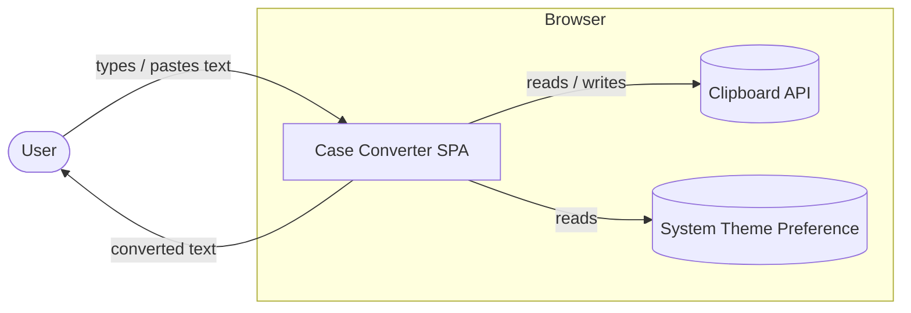

## 2. Architecture Layers

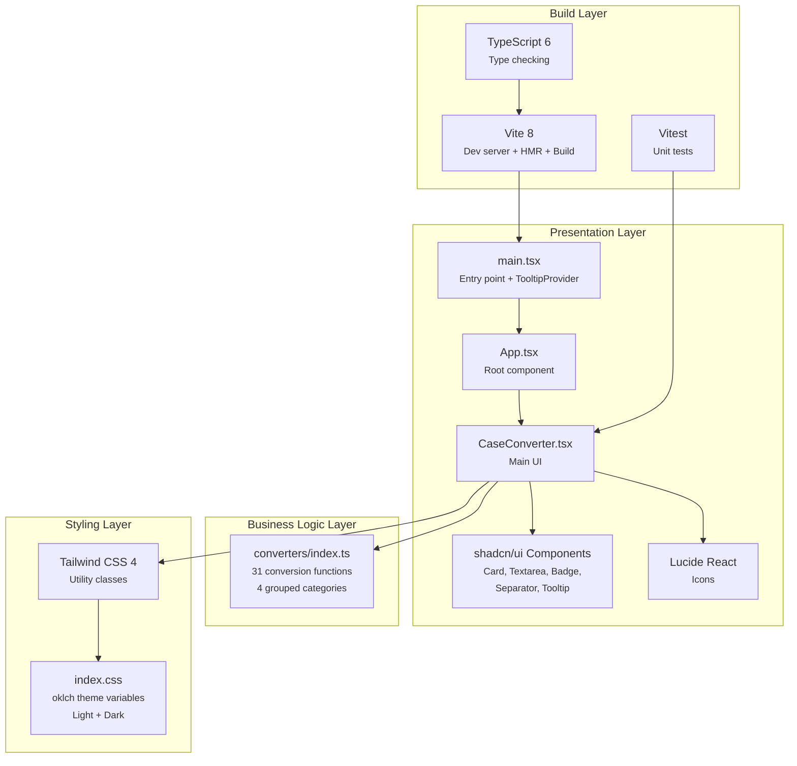

## 3. Component Hierarchy

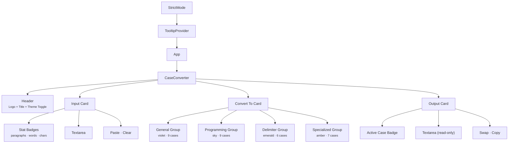

## 4. Data Flow

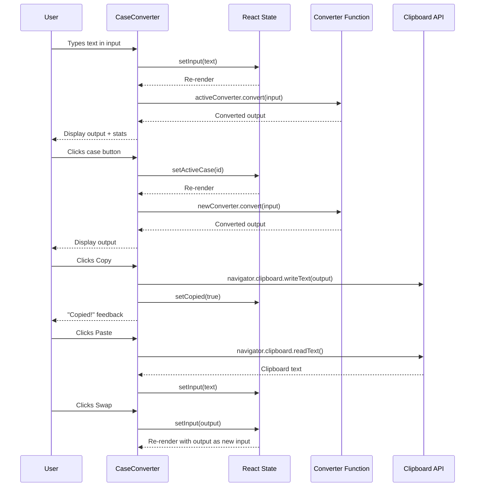

## 5. State Management

All state lives in the `CaseConverter` component via `useState`. No external state library is needed.

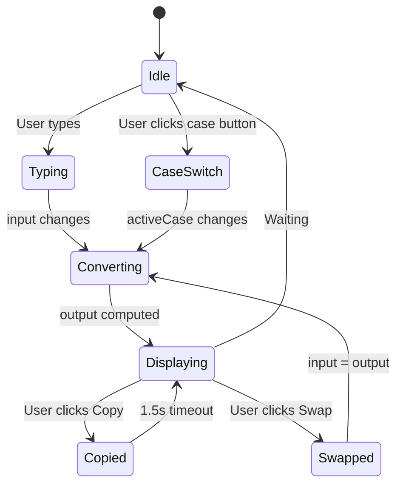

| State | Type | Default | Purpose |
|---|---|---|---|
| `input` | `string` | `''` | User's source text |
| `activeCase` | `string` | `'lower'` | Selected conversion ID |
| `copied` | `boolean` | `false` | Copy feedback flag |
| `dark` | `boolean` | System pref | Theme toggle |

Derived values (no state needed):
- `output` — computed from `activeConverter.convert(input)`
- `charCount`, `wordCount`, `paraCount` — computed from `input`

## 6. Conversion Pipeline

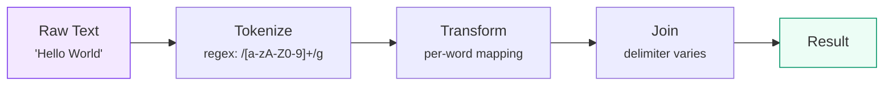

### Conversion Groups

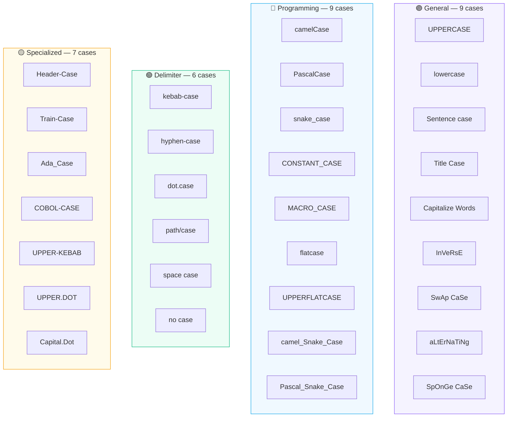

## 7. Theme System

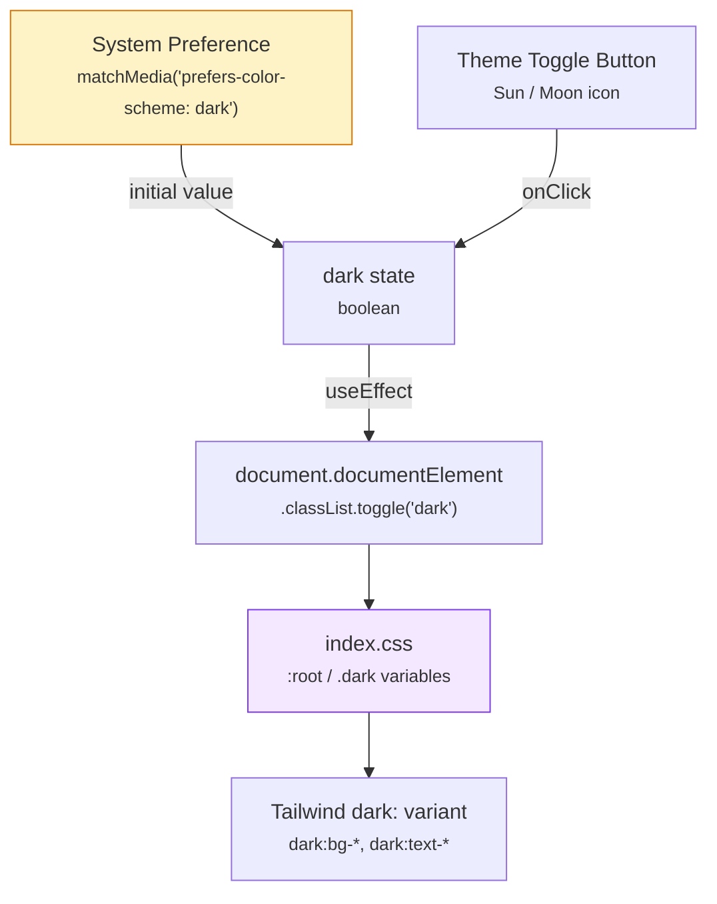

## 8. Build & Test Pipeline

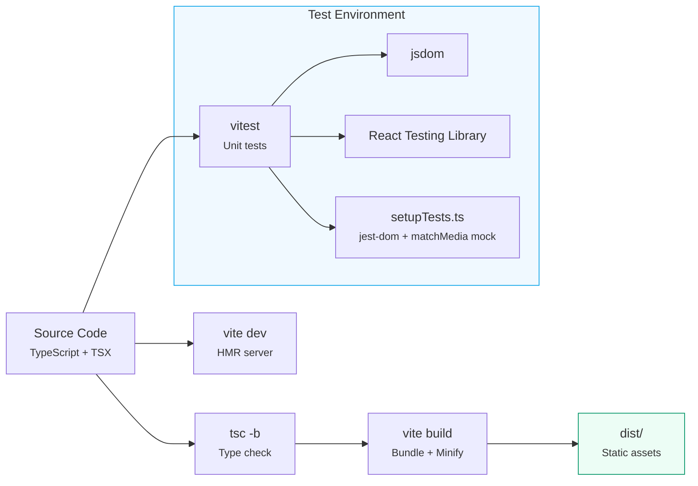

## 9. CI/CD — GitHub Pages Deployment

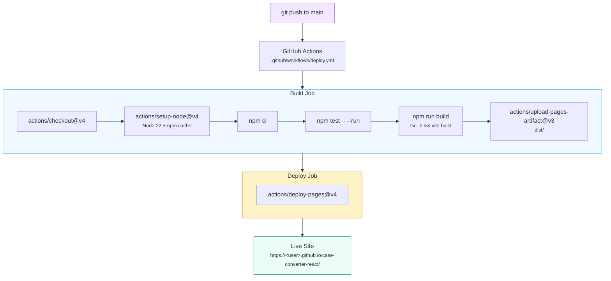

Key configuration:
- `vite.config.ts` sets `base: '/case-converter-react/'` so assets resolve under the repo subpath
- The workflow uses the newer **GitHub Pages artifact** approach (no `gh-pages` branch needed)
- Tests run before build — a failing test blocks deployment
- `concurrency` ensures only one deployment runs at a time

## 10. File Map

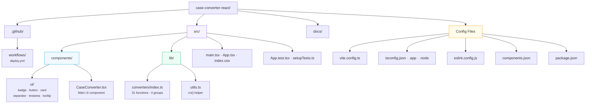
